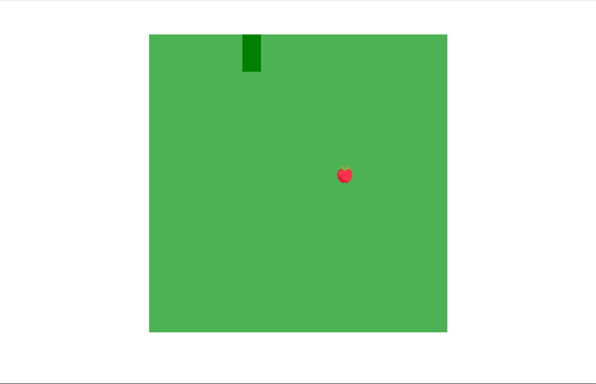

## Jogo da cobrinha
#### Jogo da cobrinha construído com usando o canvas do HTML e JavaScript.

## Tecnologias utilizadas

- HTML5 e CSS3
- JavaScript

## Começando

Como rodar o projeto na sua máquina:

1º - Baixe o projeto direto pelo link: https://github.com/DaniloLima122/Snake-game.git

ou instale o Git e digite o seguinte no seu terminal:

~~~shell
git clone https://github.com/DaniloLima122/Snake-game.git
~~~

Caso você não tenha o Git e queira instalar, acesse https://git-scm.com/downloads e baixe-o

2º Acesse a pasta do projeto que você acabou de baixar ou clonar

3º - E para ver o projeto rodando localize o arquivo index.html e abra ele no seu navegador. Divirta-se!!.

## Contribuições

Fique a vontade para contribuir ou notificar sobre bugs e dicas para melhorá-lo!

## Licença
- MIT